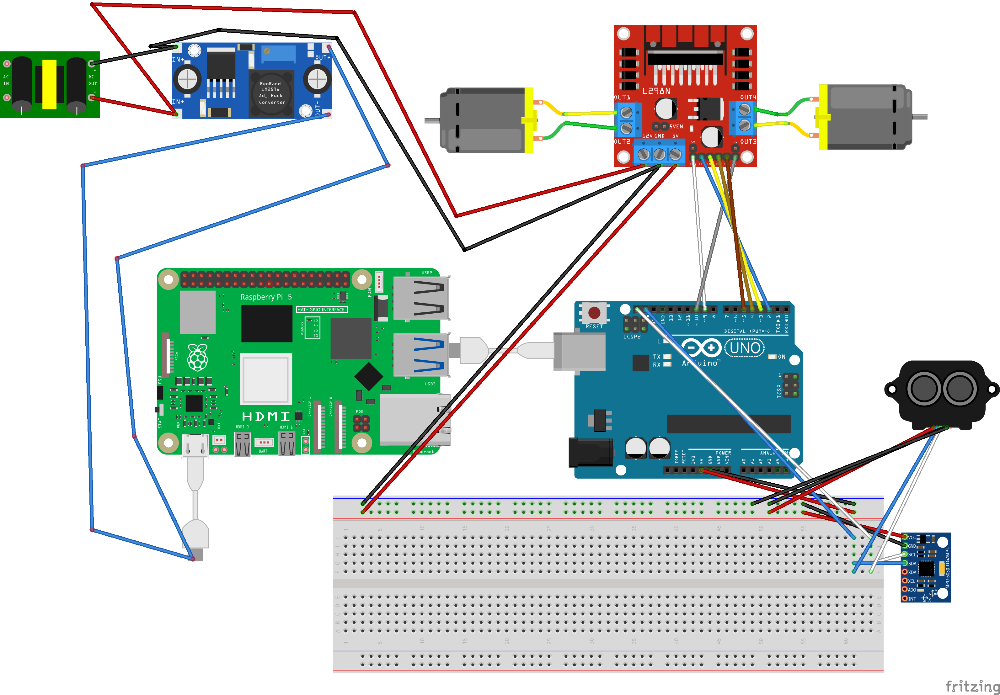

# R2D2
Create yourself an R2D2 robot! 

# Description
This robot, assuming all the electronic components are added, will have the ability to not only be remotely controlled, but has imaging, sound, and autonomous navigation. 

# Current State
Currently, this project is very much a WIP! I will update the README with a working YouTube video to showcase it's ability as a I go.

# Getting Started
There is a lot to setup with this. Considering this project includes electronics, 3d printing, robotics, software engineering, AI and more, this is both an expensive and complex project. 

## Essentials
To get started, you will need:
 - A 3d printer w/ plenty of filament
 - A soldering iron
 - Good working knowledge of: 
    - Electronics
    - 3d Printing
    - Linux
    - Docker
    - Robotics Operating System 2 (ROS2)
    - Python
    - C++
    - Machine Learning and AI

## Parts
You will need the following parts to mimic this design exactly. It is not cheap. 

### Computing Core
1) Raspberry Pi 5 8GB: https://www.canakit.com/raspberry-pi-5-8gb.html 
2) Raspberry Pi AI Kit with Extended Turbine Case, Fan, and Mega Heat Sink: https://www.canakit.com/raspberry-pi-ai-kit-with-case.html
    - You can also order these parts separate. 
    - The AI Kit is a Hailo 8L accelerator with up to 13 TOPS (Trillions of Operations Per Second) inferencing performance.
3) 512 GB MicroSD Card: https://www.amazon.com/dp/B09X7C2GBC
4) Arduino Uno: https://www.amazon.com/AEDIKO-Motor-Gearbox-Shaft-200RPM/dp/B099Z85573/ 

### Movement
1) TT Motor DC 3-6V Gearbox Motor Dual Shaft: https://www.amazon.com/AEDIKO-Motor-Gearbox-Shaft-200RPM/dp/B099Z85573/
2) Caster Wheels: https://www.amazon.com/dp/B0CZ9GNXSQ
3) Accelerometer/Gyroscope: https://www.amazon.com/dp/B00LP25V1A

### Power
1) 12V 5200mAh Battery: https://www.amazon.com/dp/B0C242DYT1
2) DC 9V 12V 24V to DC 5V 5A Buck Converter Module: https://www.amazon.com/UCTRONICS-Converter-Transformer-Voltage-Regulator/dp/B07XXWQ49N 
3) A USB C to USB A Cable: https://www.amazon.com/dp/B07DD5YHMH 
4) 22 awg Wires: https://www.amazon.com/dp/B07TX6BX47
5) Wire Strippers: https://www.amazon.com/dp/B073YG65N2  

### Imaging
1) USB Camera: https://www.amazon.com/Ximimark-Camera-Raspberry-Require-Drivers/dp/B07GWP2SGV/
2) LIDAR (TF Luna): https://www.amazon.com/gp/product/B088NVX2L7
3) LIDAR Cables: https://www.amazon.com/dp/B07PWZTC88 

## 3-D Prints

### Test Board

For me, it was helpful to have an easy test board before proceeding with the design of R2D2.

I created a circular plastic body with M3-sized holes and two expansion shafts to support multiple layers. For each layer, print:
- (1) roundBody 
- (2-3) shaftExpansion

On the top layer, you can print 
- (1) cameraLidarHolder, which allows the lidar and camera to mount to the top plate

You can also print cubeHolders as needed to secure your boards/equipment

You can access the stl prints in print/test/
I purchased these M3 screws from Amazon: https://www.amazon.com/dp/B0BMQFHDBH

This 3D print was very helpful to mount the motors to the bottom of the board: https://www.thingiverse.com/thing:1473508 

### R2D2

There are many good base models online. I found one (located in the credits section) and modified it to fit all the electronic components and screw together nicely.

I used white PETG for the feet, and white PLA for all other components. For the head and other details, I used 220 grit sandpaper and the following paints:
- Silver: Rust-Oleum Universal Titanium Silver Metallic
- Blue: Rust-Oleum Metallic Brilliant Metal Finish (Cobalt Blue)
- Gloss/Sealant: Rust-Oleum Gloss Clear Enamel

## Electronics
Here is the breadboard design for setting up this system:
 

I've left the Fritzing project here and the subparts used in case anyone wants to alter the design.

# Installation
NOTE THAT THIS IS STILL VERY MUCH A WIP. 
1) Load up your Raspberry PI 5 with a 64-bit installation of Raspberry PI. The version I used was Raspberry PI OS 12.7 64-bit.
2) Once the PI is booted and ready, copy the contents of this repo into a directory you prefer.
3) Open a terminal up and cd to the src directory. 
4) Run ```sudo pi/install.sh``` - this will install Docker, ROS, and a number of other dependencies
5) Finally, you should be able to run ```sudo run.sh``` - this will run the robotics engine


# Running It
TBD

# Credits
## 3-D Printed Parts


### r2d2
This project is a remix of the R2D2 Alexa Echo Dot 3 Dock created by Gerrylum, licensed under CC BY-NC 4.0: https://www.printables.com/model/35415-screen-accurate-r2d2-alexa-echo-dot-3-dock

I modified the original design by scaling it up, making accomodations for electronic components, and screw holes.

Additional body detail parts were sourced from this remix.

### motorMount
Motor mount by b2vn on Thingiverse: https://www.thingiverse.com/thing:1473508
This 3D model was created by b2vn on Thingiverse and is licensed under the Creative Commons Attribution-ShareAlike (CC BY-SA) license.

## Sounds
Sounds downloaded from: https://www.101soundboards.com/boards/10634-r2-d2-sounds-star-wars

## Fritzing Parts
### bb-usb-cable
This part was created by vanepp on the Fritzing Forum.
The part is shared for public use as part of the open-source Fritzing community.
Original Source: https://forum.fritzing.org/t/usb-cable-in-breadboard-view/11697

### dc_motor_devre
This part was created by bminaa on the Fritzing website.
The part is shared for public use as part of the open-source Fritzing community.
Original Source: https://fritzing.org/projects/dc-motor

### generic-ac-power-supply
This part was created by vanepp on the Fritzing Forum.
The part is shared for public use as part of the open-source Fritzing community.
Original Source: https://forum.fritzing.org/t/i-need-a-power-supply/8471

### L298N DC motor driver
This part was created by codefls on the Fritzing Forum.
The part is shared for public use as part of the open-source Fritzing community.
Original Source: https://forum.fritzing.org/t/h-bridge-with-l298n-motor-driver/7711 

### MPU-6050 Board GY-521
This part was created by charlesrct on the Fritzing Website.
The part is shared for public use as part of the open-source Fritzing community.
Original Source: https://fritzing.org/projects/mpu-6050-board-gy-521-acelerometro-y-giroscopio 

### Raspberry-Pi5
This part was created by vanepp on the Fritzing Forum.
The part is shared for public use as part of the open-source Fritzing community.
Original Source: https://forum.fritzing.org/t/looking-for-raspberry-pi-5-fritzing-part/21511

### tfluna-lidar
This part was created by vanepp on the Fritzing Forum.
The part is shared for public use as part of the open-source Fritzing community.
Original Source: https://forum.fritzing.org/t/tf-luna-8m-low-cost-distance-sensor/16499 